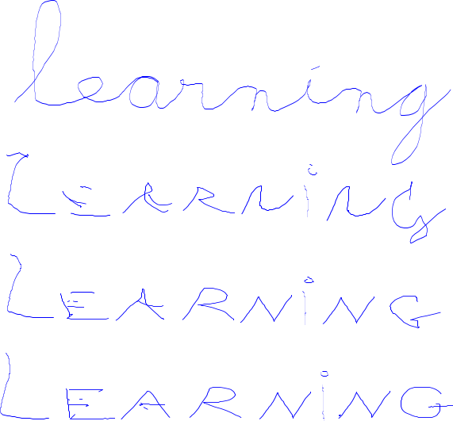

`Allograph` is a library for computer/robot-supported handwriting
activities. It provides algorithms to learn allograph of letters/numbers in
different metrics and different learning strategies from demonstration.

*Robot writing in a cursive way learning non-cursive letters.*

Different metrics including : euclidian distance in cartesian space, euclidian
distance in eigenspace with PCA, decomposition in mixture of sigma-log-normal
distributions, Recurrent neural networks.
